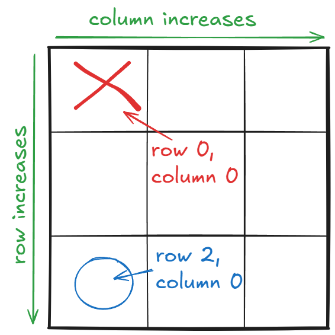

# Connect 4 AI Bot Skeleton
To run the game UI, run the command below in the terminal.
```
python main.py
```

You'll be creating your own AI bot to play Connect 4. In order to do that, we first need to agree with the computer what it means to play Connect 4.

# Grids and Boards
Connect 4 is played on a board. A board, or a **grid**, is made from a bunch of squares, or **cells**. You can locate each cell with a **row index** and **column index**.

In our case, we will say that: when you move from top to bottom, row increases.

Similarly: when you move from left to right, column increases.

For example, in a tic-tac-toe board, the top left has row index 0 and column index 0, or (0, 0). The cell all the way below that has position (2, 0).




To represent a grid in Python, we will use a nested list, or a list inside a list.

Each element in this nested list will represent a row: [row1, row2, row3].

Each row is a list containing the elements of that row: [X, O, O].

This way, we can "visually program" the grid. For example, we can directly draw 3 Xs along the downward diagonal using the nested list below:

[[X, O, O],

 [O, X, O],

 [O, O, X]]

Check if this makes sense by running the command below in the terminal.
```
python checker -q grid_index -u
```

# Cells and Players
Finally, to make the board complete we also need to agree with the computer what is inside each cell.

Here, if a cell is 0, then player 0 has their token inside of there. Same for player 1: if the cell has a 1, then that's player 1's token.

If a cell is -1, then it is empty. The summary is below.

- **-1: empty**
- **0: player 0**
- **1: player 1**

Check if this makes sense by running the command below in the terminal.
```
python checker -q cells -u
```

# Writing your Own Connect 4 Bot
Open up the `game_ai.py` file and fill out the `pick_move` function. This function will take in the current state of the board and the current player, and return the column index of the move that the bot wants to make.

Some helper functions have been provided for you.

# Sources
- [connect-four-ai](https://github.com/benjaminrall/connect-four-ai), for inspiration on computer bot implemented here.
- [okpy](https://okpy.github.io/documentation/), for the auto grader.
